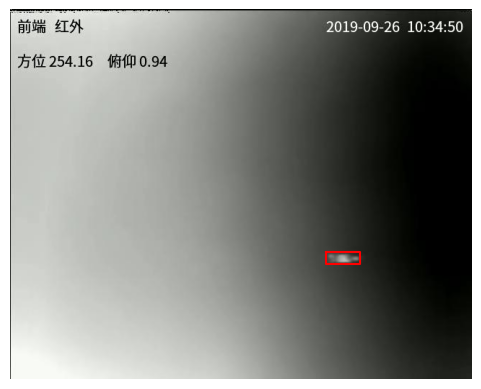

# TIR_drone_detection
Thermal Infrared Drone Detection

## Usage
### Data preparation
Unzip the UAV dataset to the dir "dataset" and rename it as "UAV_dataset" like
```
|-- dataset
    |-- UAV_dataset
        |--train
           |--...
        |--test
           |--...
```
Then run the python file "preparedataset.py" to split the train and val dataset, and get the correspinding mask of each image.
```
python preparedataset.py
```

### Train
To train the model on UAV_dataset with default settings, run:
```
python train.py
```
The setting files of training commands can be found and adjust in [parse_args_train](./model/parse_args_train.py).

### Val
To test the performace on UAV_dataset with default settings, run:
```
python test.py
```
The setting files of training commands can be found and adjust in [parse_args_tese](./model/parse_args_test.py).

### Inference
To use the trained model to predict on test set, run:
```
python inference.py
```
The result of txt file will be found in the file folder "test_prediction".

### Calculate accuracy
To calculate accuracy on annotated dataset, run:
```
python cal_acc.py
```
The acc result of each video will be found in the txt file "acc_reslut.txt".

### Visualize
To obtain the visualization effect of the model at a certain frame, run:
```
python visualize.py
```
And there will be a picture named "visualize.png".

### Result
After trained for 10 epochs, the mIoU on val set is 0.6091.

